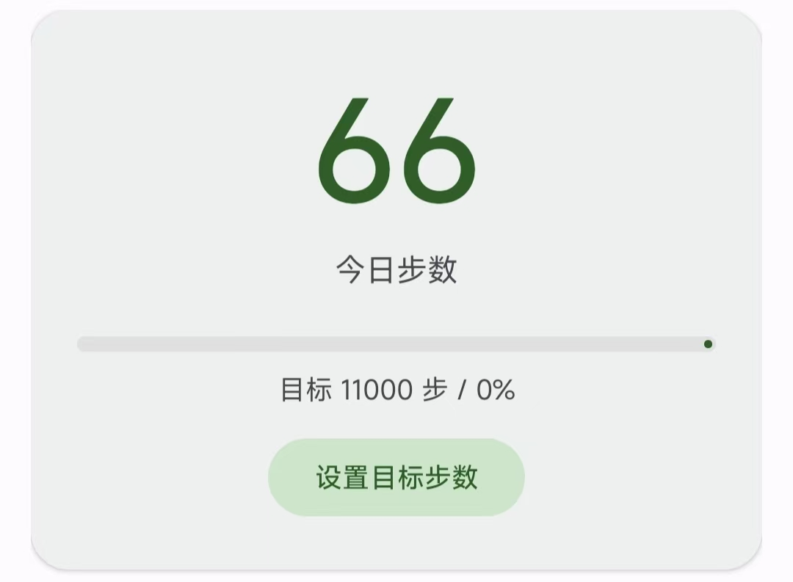
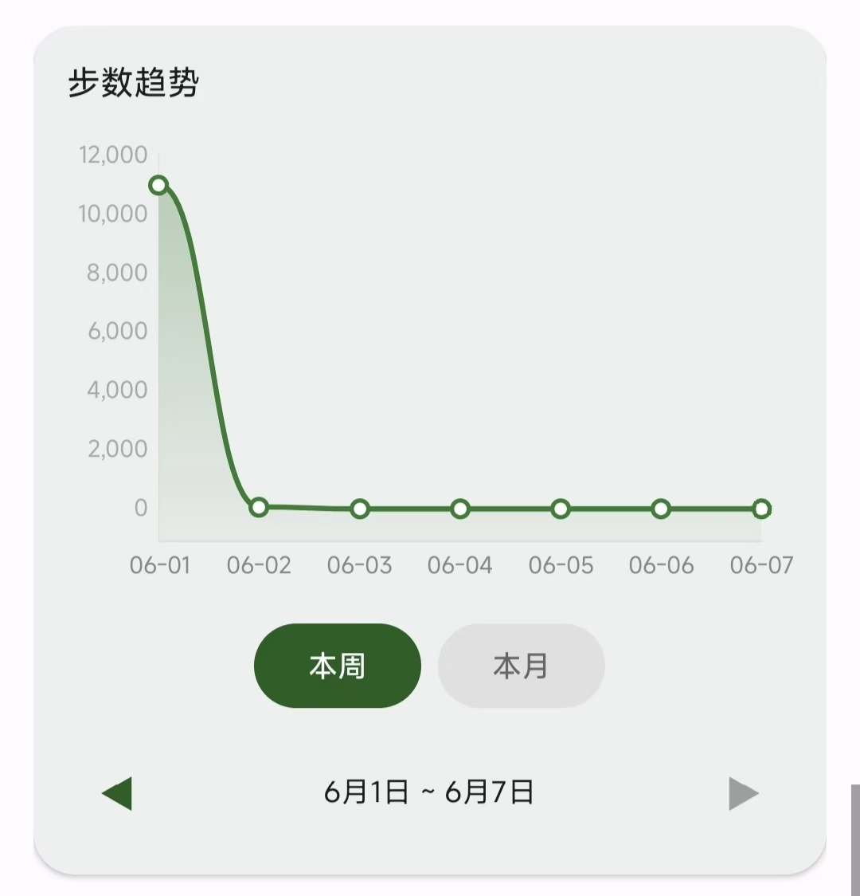
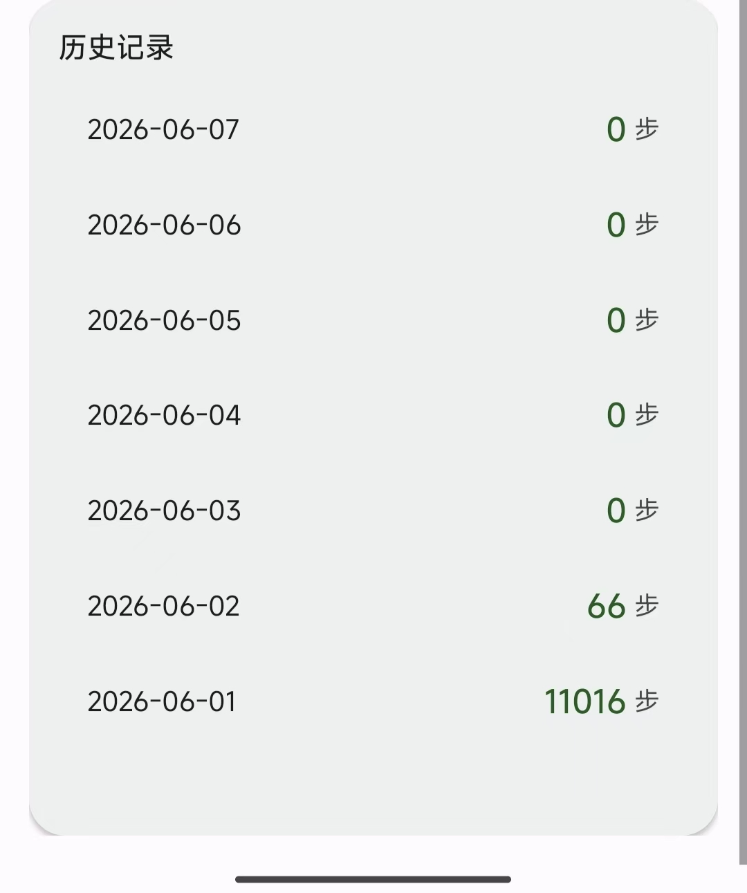
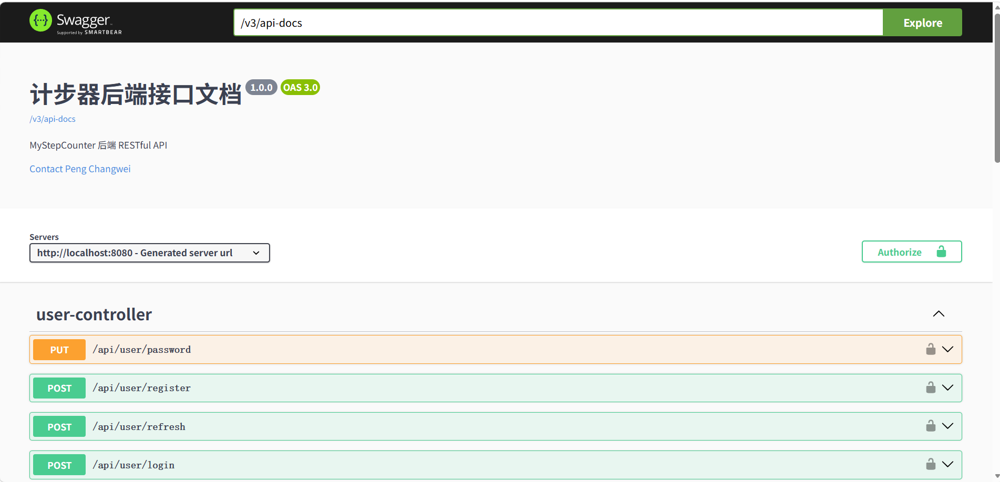
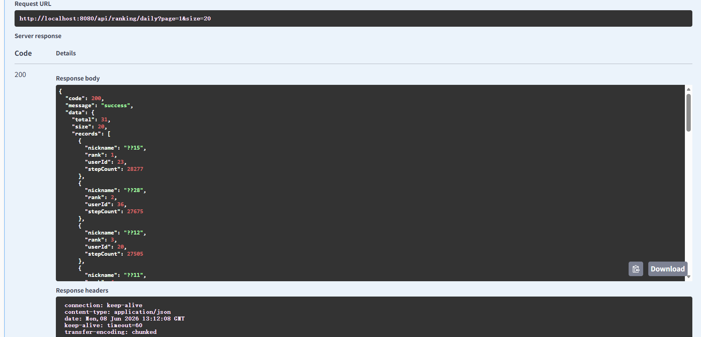

# MyStepCounter

[](https://github.com/peng369-cn/MyStepCounter/actions/workflows/test.yml)

基于 Android 前台服务的计步器应用，支持后台持续计步、步数趋势图表和历史记录查询。

后端采用 Spring Boot 3 + MyBatis-Plus + MySQL + Redis + JWT，提供用户认证、数据同步和全平台排行榜服务。

## 功能

- **实时计步**：前台服务持续监听系统计步传感器，通知栏显示当前步数
- **每日目标**：自定义步数目标，卡片内进度条直观展示完成度
- **步数趋势**：本周/本月折线图，支持左右翻页查看历史数据
- **历史记录**：按日期倒序展示每日步数，数据持久化到本地数据库
- **数据保护**：传感器重启归零时自动合并数据库历史数据，避免步数丢失
- **跨天重置**：午夜自动切换日期、清零基线，新一天从零开始
- **云端同步**：用户注册/登录后步数自动上传云端，卸载重装数据不丢
- **全平台排行榜**：查看今日步数排名和累计总步数排名，支持分页

## 截图

<div align="center">
  
  
  
</div>

<br>

<div align="center">
  
  
</div>

## 技术栈

| 类别 | 技术                                  |
|------|-------------------------------------|
| 语言 | Java 11                             |
| 架构 | MVVM (ViewModel + LiveData)         |
| 数据库 | Room                                |
| 图表 | MPAndroidChart 3.1.0                |
| UI | Material Design 3                   |
| 构建 | Gradle Kotlin DSL + Version Catalog |
| 测试 | JUnit 4                             |
| 最低版本 | Android 8.0 (API 26)                |
| 目标版本 | Android 15 (API 35)                 |

### 后端

| 类别 | 技术 |
|------|------|
| 框架 | Spring Boot 3.2 |
| ORM | MyBatis-Plus 3.5 |
| 数据库 | MySQL 8.0 |
| 缓存 | Redis |
| 认证 | JWT 双Token（access 15分钟 + refresh 30天） |
| API 文档 | SpringDoc OpenAPI |
| 构建 | Maven + Docker Compose |
| CI | GitHub Actions |

## 项目结构
```text
app/src/main/java/com/pengchangwei/stepcounter/
├── MainActivity.java          # 主界面
├── StepCounterService.java    # 前台计步服务
├── StepCalculator.java        # 计步核心计算
├── StepViewModel.java         # MVVM ViewModel
├── AppDatabase.java           # Room 数据库单例
├── StepDao.java               # 数据库操作接口
├── StepRecord.java            # 每日步数实体
└── HistoryAdapter.java        # 历史列表适配器

server/src/main/java/com/pengchangwei/stepserver/
├── controller/
│   ├── UserController.java    # 注册、登录、Token 刷新
│   ├── StepController.java    # 步数上报、查询
│   └── RankingController.java # 排行榜
├── service/
│   ├── UserService.java
│   ├── StepRecordService.java
│   └── RankingService.java    # Redis 缓存 + MySQL
├── security/
│   ├── JwtUtil.java           # JWT 签发与三级校验
│   ├── JwtInterceptor.java    # 请求拦截，异常转 401
│   └── LoginUser.java
├── common/
│   ├── GlobalExceptionHandler.java
│   ├── BusinessException.java
│   ├── ErrorCode.java
│   └── Result.java
├── annotation/
│   └── RateLimit.java
├── aspect/
│   └── RateLimitAspect.java
├── config/
├── dto/
├── entity/
└── mapper/
```

## 权限

| 权限 | 用途 | 类型 |
|------|------|------|
| `ACTIVITY_RECOGNITION` | 读取计步传感器数据 | 运行时申请 |
| `FOREGROUND_SERVICE` | 启动前台服务 | 安装时授予 |
| `FOREGROUND_SERVICE_DATA_SYNC` | 前台服务类型声明 | 安装时授予 |
| `POST_NOTIFICATIONS` | 发送通知 | 运行时申请 |

## 计步逻辑

- 今日步数 = 传感器当前累计值 − 今日零点基线值
- 基线值通过 SharedPreferences 持久化，跨天自动归零
- 传感器重启归零时，从 Room 数据库恢复已记录的步数，与新传感器差值合并
- 所有 UI 最终从 Room 数据库读取，保证数据一致性

## 性能测试

排行榜接口引入 Redis 缓存（TTL 1分钟），提供纯 MySQL 对比接口。

串行 500 次调用对比：

| 接口 | 缓存 | 500次耗时 | 平均延迟 |
|------|------|----------|---------|
| `/api/ranking/daily` | Redis | 1169ms | 2.3ms |
| `/api/ranking/no-cache` | MySQL | 3693ms | 7.4ms |

> Redis 缓存延迟降低 68%，提升约 3.2 倍。

## 安全防护

### JWT 三级安全防护

| 级别 | 机制 | 用途 |
|------|------|------|
| 一级 | 密钥轮换 | 定期更换签名密钥 |
| 二级 | 全局版本号 | 紧急踢掉所有用户 |
| 三级 | tokenVersion | 改密码后旧 Token 立即失效 |

### AOP 限流

`@RateLimit` 注解 + Redis 计数器，核心接口 60秒200次窗口限流。

### 全局异常拦截

三层 catch（业务异常 → 参数校验 → 兜底），JwtInterceptor 异常转 401 不穿透。

## 构建运行

### Android

```bash
git clone https://github.com/peng369-cn/MyStepCounter.git
cd MyStepCounter
./gradlew assembleDebug
adb install app/build/outputs/apk/debug/app-debug.apk
```

### 后端

```bash
cd server
mvn spring-boot:run
```

Docker 部署：

```bash 
cd server
 docker-compose up -d
```

## 许可

MIT License
